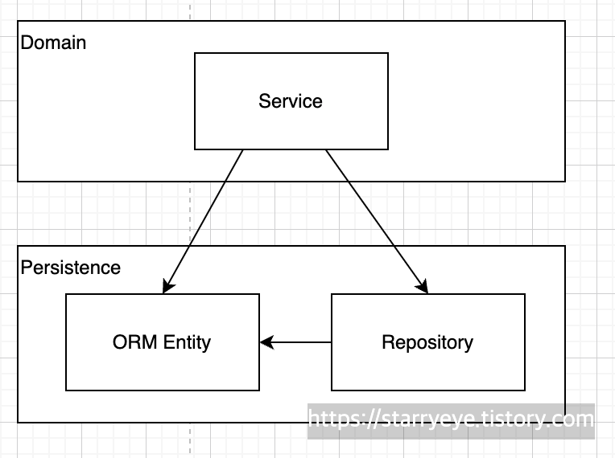
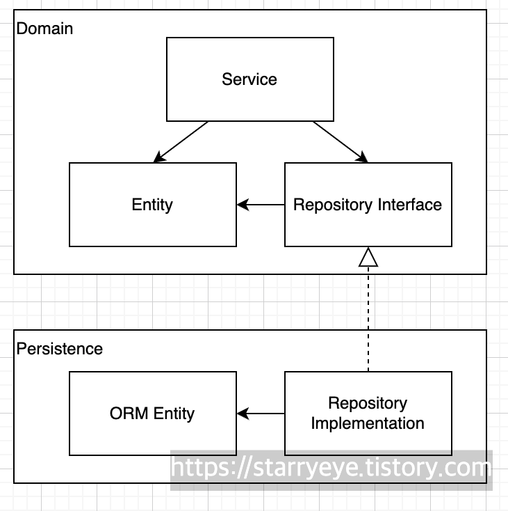
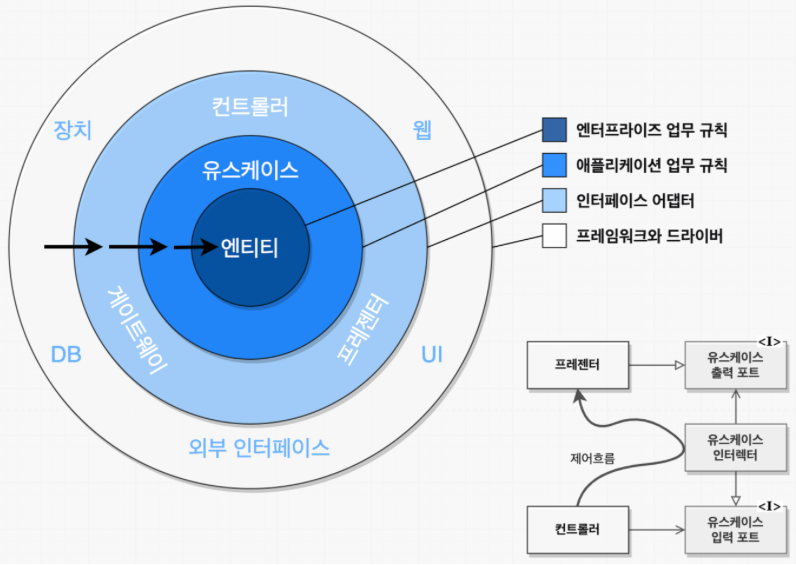
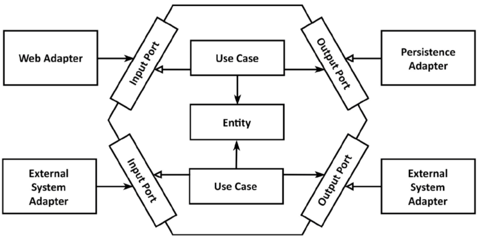

## Chapter 1. 계층형 아키텍처의 문제는 무엇일까?

계층형 아키텍처는 견고한 아키텍처 패턴이다. 잘 이해하고 구성한다면 독립적인 계층 로직을 작성할 수 있다.
하지만 코드에 나쁜 습관을 스며들기 쉽게 만들고, 변화에 대응하기 어렵게 만드는 허점들을 노출한다.

### 계층형 아키텍처는 데이터베이스 주도 설계를 유도한다

정의에 따르면 계층형 아키텍처의 토대는 데이터베이스다.
따라서 지금까지의 계층형 아키텍처를 구성할 때 데이터베이스 구조를 먼저 생각하고 이를 토대로 도메인 로직을 구현했을 것이지만 비즈니스 관점에서는 전혀 맞지 않는 방법이다.

데이터베이스 중심적인 아키텍처가 만들어지는 가장 큰 원인은 ORM(Object Relational Mapping, 객체 관계 매핑) 프레임워크를 사용하기 때문이다. ORM에 의해 관리되는 엔티티들은 일반적으로 영속성 계층에 두게 되는데 이렇게 되면 영속성 계층과 도메인 계층 사이에 **강한 결합**이 생긴다.

따라서 영속성 코드가 도메인 코드에 녹아들어가서 둘 중 하나만 바꾸는 것이 어려워진다. 이는 계층형 아키텍처의 목표와 정확히 반대되는 상황이다.

### 지름길을 택하기 쉬워진다

전통적인 계층형 아키텍처에서 전체적으로 적용되는 유일한 규칙은 **특정한 계층에서는 같은 계층에 있는 컴포넌트나 아래에 있는 계층에만 접근이 가능하다**는 것이다.
따라서 만약 상위 계층에 접근해야 한다면 간단하게 컴포넌트를 계층 아래로 내려버리면 그만이다.
하지만 이럴수록 영속성 계층은 비대해지고 전지전능한 컴포넌트가 만들어질 가능성도 있다.

### 테스트하기 어려워진다

계층형 아키텍처로 코드를 구성한다면 계층을 도메인 계층을 건너뛰는 유혹도 받게 된다. 이런 일이 자주 일어난다면 두 가지 문제점이 생긴다.

첫 번째 문제는 단 하나의 필드를 조작하는 것에 불과하더라도 도메인 로직을 웹 계층에 구현하게 된다.
두 번째 문제는 웹 계층 테스트에서 도메인, 영속성 계층도 mocking해야 한다.
시간이 흘러 규모가 커지면 다양한 영속성 컴포넌트에 의존성이 많이 쌓이면서 테스트의 복잡도를 높이고 테스트 코드를 작성하는 것보다 mock을 만드는데 더 많은 시간이 걸리게 된다.

### 유스케이스를 숨긴다

계층형 아키텍처에서는 도메인 로직이 여러 계층에 걸쳐 흩어지기 쉽다. 따라서 기능을 추가하거나 변경할 적절한 위치를 찾는 일은 더욱 어려워진다. 또한 도메인 서비스의 너비에 관한 규칙을 정의하지 않기 때문에 시간이 지나면 여러 개의 유스케이스를 담당하는 아주 넓은 서비스가 만들어지기도 한다.

넓은 서비스는 영속성 계층에 많은 의존성을 갖게 되고, 많은 컴포넌트가 이를 의존하게 된다. 이는 테스트를 더욱 어렵게 할 뿐만 아니라 작업해야 할 유스케이스를 책임지는 서비스를 찾기도 어려워진다.

### 동시 작업이 어려워진다

계층형 아키텍처는 영속성 계층을 개발하고, 도메인 계층, 마지막으로 웹 계층을 만들어야 하므로 특정 기능은 동시에 한 명의 개발자만 작업할 수 있다. 또한 위에 언급했던 넓은 서비스가 코드에 존재한다면 서로 다른 기능을 동시에 작업하기는 더욱 어려워진다.
 
### 유지보수 가능한 소프트웨어를 만드는 데 어떻게 도움이 될까?

이러한 단점들이 존재하지만 올바르게 구축하고 몇 가지 추가 규칙들을 적용하면 계층형 아키텍처는 유지보수가 매우 쉬워지고 변화에 대응하기 수월하다. 하지만 잘못된 방향으로 흘러가도록 용인하므로 함정을 염두에 두어 지름길을 택하지 않고 유지보수하기에 더 쉬운 솔루션을 만드는데 집중해야 한다.

 

## Chapter 2. 의존성 역전하기

### 단일 책임 원칙 (SRP: Single Responsibility Principle)

    하나의 컴포넌트는 오로지 한 가지 일만 해야 하고, 그것을 올바르게 수행해야 한다.

좋은 조언이지만 실제 의도는 아니다. 실제 정의는 다음과 같다.

    컴포넌트를 변경하는 이유는 오직 하나뿐이어야 한다.

아키텍처에서는 이것이 어떤 의미일까?

만약 컴포넌트를 변경할 이유가 한 가지라면 우리가 어떤 다른 이유로 소프트웨어를 변경하더라도 이 컴포넌트에 대해서는 전혀 신경 쓸 필요가 없다.
많은 코드는 단일 책임 원칙을 위반하기 때문에 시간이 갈 수록 변경하기가 더 어려워지고 변경 비용도 증가한다.

### 의존성 역전 원칙 (DIP: Dependency Inversion Principle)

    코드상의 어떤 의존성이든 그 방향을 바꿀 수(역전시킬 수) 있다.

Before

After

계층형 아키텍처에서 상위 계층들이 하위 계층들에 비해 변경할 이유가 더 많다. 하지만 도메인 코드는 애플리케이션에서 가장 중요한 코드이므로 해결 방안이 필요하다.
위는 도메인 코드와 영속성 코드 간의 의존성을 역전시켜서 영속성 코드가 도메인 코드에 의존하고, 도메인 코드를 **변경할 이유**의 개수를 줄였다.

### 클린 아키텍처

클린 아키텍처는 도메인 코드가 바깥으로 향하는 어떠한 의존성도 없어야 함을 의미한다. 대신 DIP의 도움으로 모든 의존성이 도메인 코드를 향하고 있다.

이 아키텍처에서 가장 중요한 규칙은 의존성 규칙으로 계층 간의 모든 의존성이 안쪽으로 향해야 한다는 것이다.
다시 말해, 도메인 계층이 영속성, 외부 계층과 철저히 분리돼야 하므로 애플리케이션의 엔티티 모델을 각 계층에서 유지보수 해야한다. 이를 통해 도메인 코드는 특정 프레임워크에 특화된 코드를 가질 수 없고 비즈니스 규칙에 집중할 수 있다.
또한 도메인 계층과 영속성 계층이 데이터를 주고받을 때, 두 엔티티를 서로 변환해야 한다는 뜻이기도 하다.

### 헥사고날 아키텍처

헥사고날 아키텍처는 클린 아키텍처를 조금 더 구체적으로 만들어주는 아키텍처이다.
육각형에서 외부로 향하는 의존성이 존재하지 않으므로 클린 아키텍처에서 제시한 의존성 규칙이 그대로 적용된다.

코어를 기준으로 좌측 어댑터들은 애플리케이션을 주도하는 어댑터(driving adapter), 우측 어댑터들은 애플리케이션에 의해 주도되는 어댑터(driven adapter)이다.

위 구조에서 주도하는 어댑터에게는 Input Port가 유스케이스 클래스에서 구현되고 어댑터에 의해 호출된다. 반대로 주도되는 어댑터에게는 Output Port가 어댑터에서 구현되고 코어에 의해 호출된다.

 

## Chapter 3. 코드 구성하기

